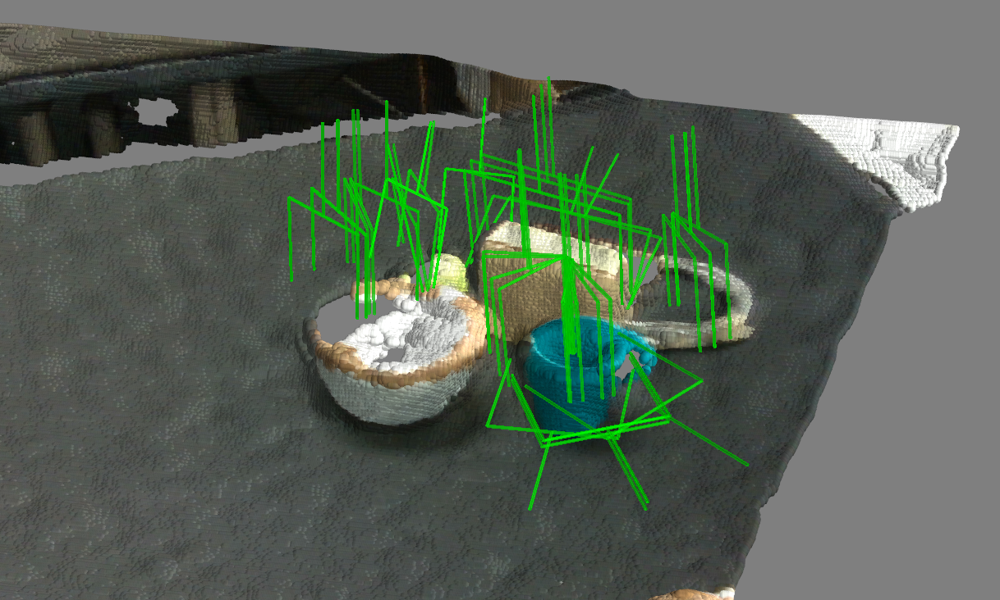

# Keypoint-GraspNet (KGN)

Code release for our paper [Keypoint-GraspNet: Keypoint-based 6-DoF Grasp Generation from the Monocular RGB-D input](https://arxiv.org/abs/2209.08752) and [KGNv2: Separating Scale and Pose Prediction for Keypoint-based 6-DoF Grasp Synthesis on RGB-D input](https://arxiv.org/abs/2303.05617).


## Installation

Please follow [INSTALL.md](docs/INSTALL.md) to prepare for the environment.


## Demo

First download our released weights for [KGNv1](https://www.dropbox.com/s/rbsxxo2k5tudzue/kgnv1.pth?dl=0) and/or [KGNv2](https://www.dropbox.com/s/60ikopqimym0r2r/kgnv2.pth?dl=0). Put them under the folder ``./exp``. Then run the demo on real world data via:

```bash 
bash experiments/demo_kgnv{1|2}.sh
```

NOTE: the released KGNv1 weight is trained on single-object data, while the KGNv2 weight is trained on multi-object data.

You should seem example results (from kgnv2):

<p align="center">
  
</p>


## Train and evaluate

### Data generation

The dataset used in the papers can be downloaded from the links: [sinlge-object](https://www.dropbox.com/s/gfcddf7awkjw1wy/ps_grasp_single_1k.zip?dl=0) and [multi-object](https://www.dropbox.com/s/kmysg23usmaycmf/ps_grasp_multi_1k.zip?dl=0). Download, extract, and put them in the ``./data/`` folder.


Alternatively, you can also generate the data by yourself. For single-object data generation:

```bash
python main_data_generate.py --config_file lib/data_generation/ps_grasp_single.yaml
```

Multi-object data generation:

```bash
python main_data_generate.py --config_file lib/data_generation/ps_grasp_multi.yaml
```


### Train

First download pretrained [ctdet_coco_dla_2x](https://github.com/xingyizhou/CenterNet) model following the instruction. Put it under ``./models/``  folder.

Then run the training code.

```bash
bash experiments/train_kgnv{1|2}.sh {single|multi}
```

``single/multi``: Train on single- or multi-object data. 


### Evaluation

```bash
bash experiments/test_kgnv{1|2}.sh {single|multi} {single|multi}
```

First ``single/multi``: Evaluate the weight trained on single- or multi-object data. 

Second ``single/multi``: Evaluate on single- or multi-object data. 


## Acknowledgement

Some code borrowed from the [CenterPose](https://github.com/NVlabs/CenterPose.git) and [Acronym](https://github.com/NVlabs/acronym). 


# Citation

Please consider citing our work if you find the code helpful:

```
@inproceedings{chen2022keypoint,
  title={Keypoint-GraspNet: Keypoint-based 6-DoF Grasp Generation from the Monocular RGB-D input},
  author={Chen, Yiye and Lin, Yunzhi and Xu, Ruinian and Vela, Patricio},
  booktitle={IEEE International Conference on Robotics and Automation (ICRA)},
  year={2023}
}

@article{chen2023kgnv2,
  title={KGNv2: Separating Scale and Pose Prediction for Keypoint-based 6-DoF Grasp Synthesis on RGB-D input},
  author={Chen, Yiye and Xu, Ruinian and Lin, Yunzhi and Chen, Hongyi and Vela, Patricio A},
  journal={arXiv preprint arXiv:2303.05617},
  year={2023}
}
```

